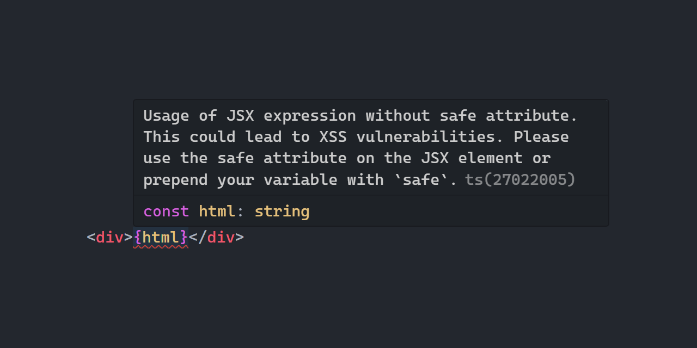

<p align="center">
   <b>Using this package?</b> Please consider <a href="https://github.com/sponsors/arthurfiorette" target="_blank">donating</a> to support my open source work ❤️
  <br />
  <sup>
   Help @kitajs/ts-html-plugin grow! Star and share this amazing repository with your friends and co-workers!
  </sup>
</p>

<br />

<p align="center" >
  <a href="https://kita.js.org" target="_blank" rel="noopener noreferrer">
    
  </a>
</p>

<br />

<div align="center">
  <a title="MIT license" target="_blank" href="https://github.com/kitajs/ts-html-plugin/blob/master/LICENSE"></a>
  <a title="NPM Package" target="_blank" href="https://www.npmjs.com/package/@kitajs/ts-html-plugin"></a>
  <a title="Bundle size" target="_blank" href="https://bundlephobia.com/package/@kitajs/ts-html-plugin@latest"></a>
  <a title="Last Commit" target="_blank" href="https://github.com/kitajs/ts-html-plugin/commits/master"></a>
  <a href="https://github.com/kitajs/ts-html-plugin/stargazers"></a>
</div>

<br />
<br />

<h1>🏛️ KitaJS TypeScript Html Plugin</h1>

<p align="center">
  <code>@kitajs/ts-html-plugin</code> is a CLI tool & TypeScript LSP for finding XSS vulnerabilities in your TypeScript code.
  <br />
  <br />
</p>

<br />

- [Installing](#installing)
- [Preview](#preview)
- [Getting Started](#getting-started)
- [Running as CLI](#running-as-cli)
- [Handling Warnings](#handling-warnings)
- [Vscode](#vscode)
- [Error codes](#error-codes)
  - [K601](#k601)
  - [K602](#k602)
  - [K603](#k603)
  - [K604](#k604)
- [JSX](#jsx)
- [Special cases](#special-cases)

<br />
<br />

## Installing

```sh
npm install @kitajs/ts-html-plugin
```

<br />

## Preview



<br />

## Getting Started

Install `@kitajs/ts-html-plugin` alongside with `@kitajs/ts-html-plugin` with your
favorite package manager, and put this inside your `tsconfig.json`.

```jsonc
// tsconfig.json

{
  "compilerOptions": {
    "jsx": "react",
    "jsxFactory": "Html.createElement",
    "jsxFragmentFactory": "Html.Fragment",
    "plugins": [{ "name": "@kitajs/ts-html-plugin" }]
  }
}
```

[Make sure to understand what language service plugins can and cannot do.](https://github.com/microsoft/TypeScript/wiki/Writing-a-Language-Service-Plugin#whats-a-language-service-plugin)

<br />

## Running as CLI

You can also run this project as a CLI tool. Which is a great way to ensue project-wide
security. Also it's a great way to integrate with your CI/CD pipeline.

```sh
npm install -g @kitajs/ts-html-plugin
```

```sh
$ xss-scan --help

ts-html-plugin v1.3.1 - A CLI tool & TypeScript LSP for finding XSS vulnerabilities in your TypeScript code.

Usage: xss-scan         [options] <file> <file>...
       ts-html-plugin   [options] <file> <file>...

Options:
  --cwd <path>          The current working directory to use (defaults to process.cwd())
  -p, --project <path>  The path to the tsconfig.json file to use (defaults to 'tsconfig.json')
  -s, --simplified      Use simplified diagnostics
  -h, --help            Show this help message
  --version             Show the version number
  <file> <file>...      The files to check (defaults to all files in tsconfig.json)

Examples:
  $ xss-scan
  $ xss-scan --cwd src
  $ xss-scan --project tsconfig.build.json
  $ xss-scan src/index.tsx src/App.tsx

Exit codes:
  0 - No XSS vulnerabilities were found
  1 - XSS vulnerabilities were found
  2 - Only XSS warnings were found
```

<br />

## Handling Warnings

Sometimes, the plugin may not detect that a string or variable is safe for use and may
emit warnings, even when you are confident there are no security issues. Here are ways to
address this:

1. **Keep using use the `safe` Attribute:** Even if you are certain that the content is
   free from XSS vulnerabilities, you can still use the `safe` attribute for added
   assurance. After all, what's the problem of being safe twice?

   ```tsx
   const html = <div safe>{content}</div>;
   ```

2. **Prepend the Variable with `safe`:** Indicate to the plugin that you are confident the
   variable is safe to use by adding `safe` before it.

   ```tsx
   const safeContent = '';
   const html = <div>{safeContent}</div>;
   ```

3. **Cast to `'safe'`:** When using raw values or function calls without saving them into
   a variable, you can append `as 'safe'` to the expression to inform the plugin.

   ```tsx
   const html = <div>{content as 'safe'}</div>;
   ```

<br />

## Vscode

If you are using vscode and this plugin is not working properly, make sure to use the
current project's typescript version.

```jsonc
// .vscode/settings.json

{
  "typescript.tsdk": "node_modules/typescript/lib"
}
```

<br />

## Error codes

### K601

Usage of JSX expression without safe attribute. This could lead to XSS vulnerabilities.
Please use the safe attribute on the JSX element or prepend your variable with `safe`.

```tsx
// ❌ Content variable may have a value of `<script>alert('xss')</script>`
// which will lead to XSS vulnerabilities.
const html = <div>{content}</div>;

// ✅ Content variable may have a value of `<script>alert('xss')</script>`,
// but it's safe to use because it will get escaped to =
// `&lt;script&gt;alert('xss')&lt;/script&gt;`.
const html = <div safe>{content}</div>;

// ⚠️ Content variable may have a value of `<script>alert('xss')</script>`,
// but variable starts with safe, so the error is suppressed.
const safeContent = content;
const html = <div>{safeContent}</div>;
```

<br />

### K602

Usage of safe attribute on a JSX element whose children contains other JSX elements. It
will lead to double escaping. If this is intended behavior, please extract the children
into a separate variable and use that instead.

```tsx
// ❌ Safe attribute in the outer element will also escape inner elements.
// In this // case the <b> tag will also be escaped, resulting into
// `<a>&lt;b&gt;1&lt;/b&gt;</a>`.
const html = (
  <a safe>
    <b>1</b>
  </a>
);

// ✅ Safe attribute in the inner element will escape only the inner element.
// In this case the <b> tag will be escaped, resulting into
// `<a><b>1</b></a>`.
const html = (
  <a>
    <b safe>1</b>
  </a>
);
```

<br />

### K603

You are using a xss-prone element as a children of a component. Please wrap it into a
Html.escapeHtml() call or prepend it as a variable starting with `safe`.

This error is similar to [K601](#k601), but instead of using `safe` native attribute, you
need to use `Html.escapeHtml()` function because its a component and not a native JSX.

```tsx
// ❌ Content variable may have a value of `<script>alert('xss')</script>`
// which will lead to XSS vulnerabilities.
const html = <Component>{content}</Component>;

// ✅ Content variable may have a value of `<script>alert('xss')</script>`,
// but it's safe to use because you manually call the escape function.
const html = <Component>{Html.escapeHtml(content)}</Component>;

// ⚠️ Content variable may have a value of `<script>alert('xss')</script>`,
// but variable starts with safe, so the error is suppressed.
const safeContent = content;
const html = <Component>{safeContent}</Component>;
```

<br />

### K604

You are using the safe attribute on expressions that does not contain any XSS
vulnerabilities. Please remove the safe attribute or prepend your variable with `unsafe`.

```tsx
// ⚠️ The variable will never have any harmful XSS content, so the safe attribute is
// not needed and can be removed.
const html = <div safe>{numberVariable}</div>;

// ✅ This variable will never have any harmful XSS content, so we can use it
// as is.
const html = <div>{numberVariable}</div>;

// ✅ You manually told this plugin that the variable is unsafe, so errors will
// be thrown.
const unsafeVariable = numberVariable;
const html = <div safe>{unsafeVariable}</div>;
```

<br />

## JSX

For JSX support, please go to [kitajs/html](https://github.com/kitajs/html) for more
information.

<br />

## Special cases

1. Anything inside a `<script>` tag is allowed. If you are using a script tag, you want to
   execute the content anyways.

   ```tsx
   const html = <script>{content}</script>;
   ```

2. Ternary and binary operations are evaluated in both sides separately and will throw
   errors if any of the sides is not safe, even their condition never gets hit at runtime.

   ```tsx
   const html = <div>{true ? safeContent : content}</div>;
   //                                      ~~~~~~~
   ```

<br />
